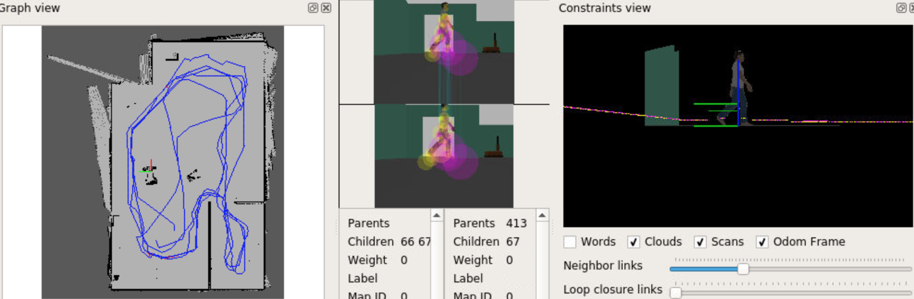
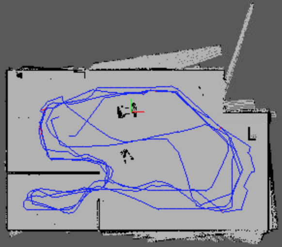
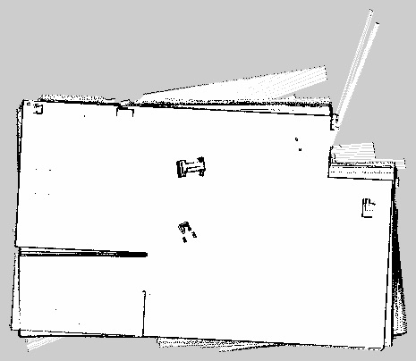
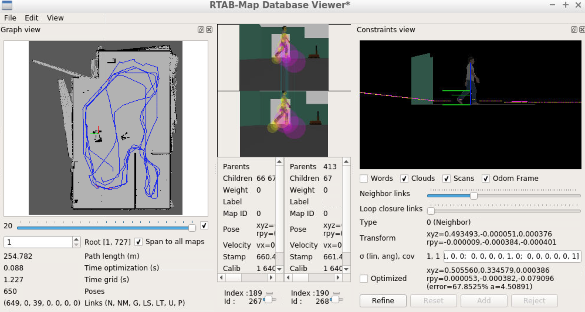

# Robot mapping using RTABMAP package from ROS

Project-5 of Udacity's Robotics Software Engineer Nanodegree Program



**Project Goals**

The goal in this project was to create a 2D occupancy grid and 3D octomap from a simulated environment via [RTAM-Map package](http://wiki.ros.org/rtabmap_ros) in ROS. For this one needed to:

* develop a package to interface with the rtabmap_ros package
* make the necessary changes to interface the robot with RTAB-Map
* verify all links to files and topics
* generate suitable launch files to launch the robot and map its surrounding environment
* use teleop to generate the map of the environment


### Prerequisites
(since I have not tested on multiple platforms, and versions, I am listing only the configuration I used)

* Ubuntu 16.04 OS with default make (>=4.1) and g++/gcc (>=5.4) packages
* Gazebo >= 7.0
* ROS Kinetic

### Directory Tree and contents


```
.
├── README.md
├── localize_teleop.sh
├── map_my_world.sh
├── my_robot
│   ├── CMakeLists.txt
│   ├── config
│   │   ├── base_local_planner_params.yaml
│   │   ├── costmap_common_params.yaml
│   │   ├── global_costmap_params.yaml
│   │   └── local_costmap_params.yaml
│   ├── launch
│   │   ├── localization.launch
│   │   ├── mapping.launch
│   │   ├── robot_description.launch
│   │   ├── teleop.launch
│   │   └── world.launch
│   ├── maps
│   │   ├── rtabmap.pgm
│   │   └── rtabmap.yaml
│   ├── meshes
│   │   └── hokuyo.dae
│   ├── package.xml
│   ├── rviz
│   │   ├── localization.rviz
│   │   └── mapping.rviz
│   ├── urdf
│   │   ├── my_robot.gazebo
│   │   └── my_robot.xacro
│   └── worlds
│       └── myroboworld.sdf
├── output
│   ├── images
│   │   ├── rtabmap.pgm
│   │   └── rtabmap.yaml
│   └── snapshots
│       ├── rtabmap_sample.jpg
│       └── rtabmap_view.jpg
├── teleop_twist_keyboard
│   ├── CHANGELOG.rst
│   ├── CMakeLists.txt
│   ├── README.md
│   ├── package.xml
│   └── teleop_twist_keyboard.py

```
---

This directory represents the main project's `src` folder structure with following contents

* README.md: this file.
* **localize_teleop.sh** - bash script to source and launch all localization related files/functions
* **map_my_world.sh** - bash script to source and launch all RTAB-Map based mapping files/functions
* **`my_robot`** - my_robot package
	* `config` - folder with files defining parameters for localization package
	* `launch` - folder for launch files
	* `maps` - previously created maps using ROS package [pgm-map-creator](https://github.com/udacity/pgm_map_creator), used in last project for AMCL based localization
	* `meshes` - meshes folder for sensors
	* `package.xml` - package info
	* `rviz` - folder with rviz configuration files
	* `urdf` - folder for xacro files
	* `worlds` - folder for gazebo world files
	* `CMakeLists.txt` - compiler instructions
* **output** - folder with output saved for reference
	* `images` - folder with images/output from `RTAB-Map databaseViewer`, some have been removed due to size constraint
		* `rtabmap.pgm` & `rtabmap.yaml` - PGM and YAML output files from rtabmap-database
	* **snapshots**: folder with images used for this *README.md* file
* **teleop-twist-keyboard** - teleop ROS package for commanding robot motion

---


### Clone and Build

Since the folder presented here comprises only of ROS package, one needs to first create a catkin workspace and initialize it. Within your `home` directory, execute the following:

```
$ mkdir -p catkin_ws/src
$ cd catkin_ws/src
$ catkin_init_workspace
```

Within `~/catkin_ws/src/` download or clone folders of this repository:

```
$ cd ~/catkin_ws/src/
$ git clone https://github.com/viks8dm/mapping_ROS.git
```

Go back to catkin workspace and build it

```
$ cd ~/catkin_ws/
$ catkin_make
```

### Launch and visualize

#### mapping

For mapping using RTAB-Map ROS package, got to `src` folder and run `map_my_world.sh` script:

```
$ cd ~/catkin_ws/src/
$ ./map_my_world.sh
```
This will launch:

* `world.launch` for robot and gazebo environment setup
* `teleop_twist_keyboard` for moving around robot
* `mapping.launch` to initiate mapping function based on RTAB-Map ROS package
* `mapping.rviz` configuration with previously saved RViz configuration which will assist with visualization while driving the robot around for mapping purposes.

Once all launch files have started one can send move commands via teleop package to control the robot, move it around within the gazebo environment, visualizing map, as it is generated within RViz display area. This will generate a database file `~/.ros/rtabmap.db` which has information about map, robot's path, constraints in environment, etc.

Remember to rename or move the `~/.ros/rtabmap.db` before your next attempt since it will be deleted due to the launch file setting in `mapping.launch`

#### mapping-result

The map was generated in this way, driving the robot in a path shown via blue lines in the following image:




The corresponding map thus generated by the RTAB-Map ROS package was saved as pgm-file and is shown here:




#### db-file link

Since database file generated was large it can be downloaded from [this link](https://www.dropbox.com/s/7gkmropc52ukqhm/rtabmap.db?dl=0)


#### database viewer

For exploring the database after generating it  the `rtabmap-databaseViewer` tool was used for further exploration:

```
$ rtabmap-databaseViewer ~/.ros/rtabmap.db
```

Once open, some windows were added for better view of the relevant information, so:

* selected `yes` to using the database parameters
* View -> Constraint View
* View -> Graph View

A sample window from the viewer is shown here:



The 3D map extracted from the viewer is also shown here; and it is evident that is closely matches the actual 3D scene.


#### localization

Teleop keyboard command based localization was also tested. To try this, go to `src` folder and run `localize_teleop.sh` script:

```
$ cd ~/catkin_ws/src/
$ ./localize_teleop.sh
```
This will launch:

* `world.launch` for robot and gazebo environment setup
* `teleop_twist_keyboard` for moving around robot
* `localization.launch` to initiate localization function based on RTAB-Map ROS package
* `localization.rviz` configuration with previously saved RViz configuration which will assist with visualization while driving the robot around for localizing the robot.
